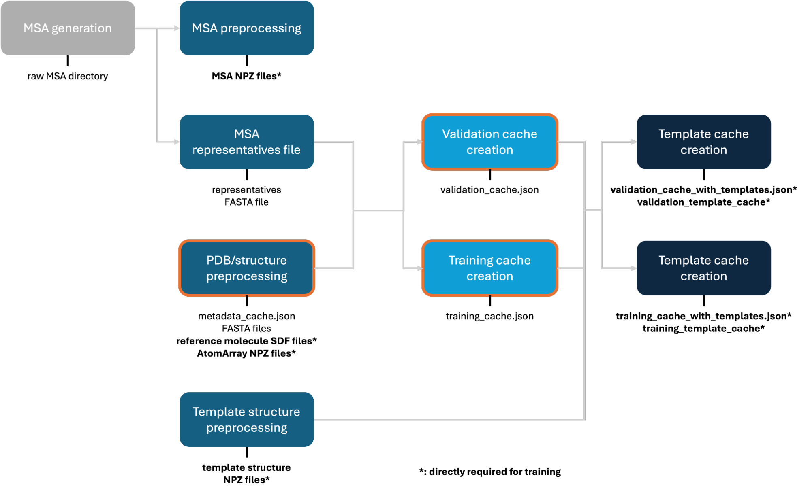
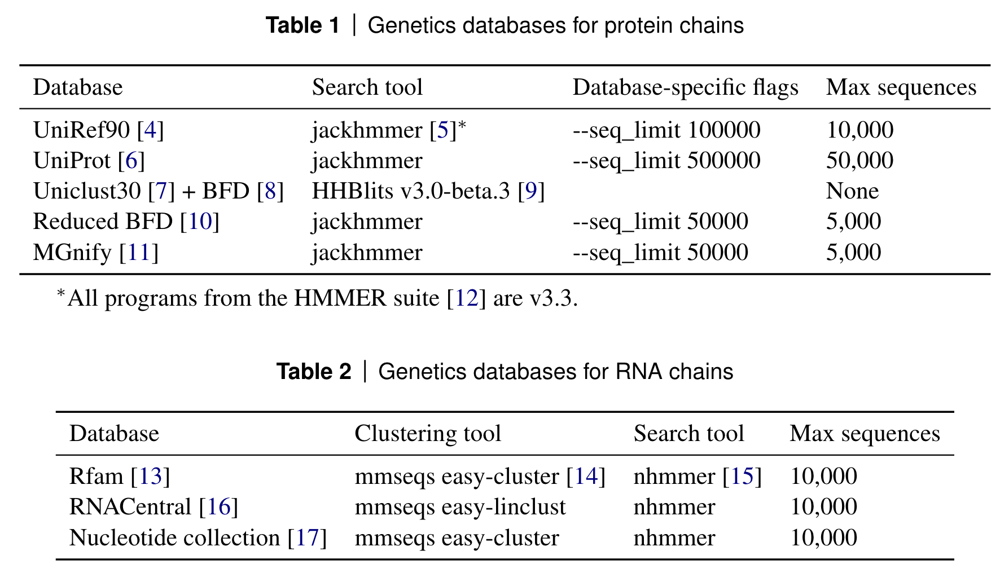
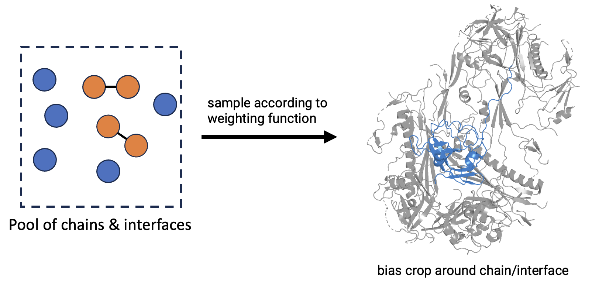
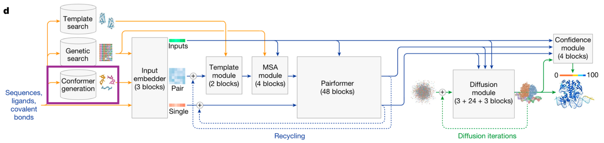

# OpenFold3 Data Pipeline

## 1. Overview

The chart below shows an overview of the full pipeline described in this document. All parts outlined in <span style="color: orange">orange</span> will require modification to work with in-house data (such as fine-tuning), while the remaining scripts should work out of the box. 
 
All output files directly required as an input to the training script are **marked in bold with an asterisk (*)**. There is technically full flexibility in modifying the pipeline as long as it generates these required outputs, though it’s recommended to stick to the format below.



## 2. Alignments

### 2.1 MSA Generation

AlphaFold3 training requires a computationally demanding MSA generation against several sequence databases:



Script: [scripts/snakemake_msa/MSA_Snakefile](https://github.com/aqlaboratory/openfold-3/blob/main/scripts/snakemake_msa/MSA_Snakefile)

Instructions on how to run are in the {doc}`MSA generation how-to<precomputed_msa_generation_how_to>`.

Generally, the MSA generation should be expected to take long for larger datasets and require significant CPU compute burden.

**Important:** Before submitting your sequences, make sure to {ref}`properly add unresolved residues<note-on-sequence-preprocessing>`.

Output of the MSA processing should be a single directory filled with subdirectories containing the different alignments for each chain, for example:

```
pdb_msas_completed/
├── 102l_A
│   ├── bfd_uniref_hits.a3m
│   ├── hmm_output.sto
│   ├── mgnify_hits.sto
│   ├── uniprot_hits.sto
│   └── uniref90_hits.sto
├── 106m_A
│   ├── ...
```

(msa-representatives-file)=
### 2.2 MSA representatives file

MSAs only need to be generated per unique sequence, so usually there are more chains in the training data than individual MSAs, with multiple of the training chains using the same MSA. In order to infer what MSA to point each chain to, an “MSA representatives file” is necessary, which is a FASTA file mapping the ID of the preprocessed MSA file to the sequence of its query:

Script: [scripts/utils/generate_representatives_from_msa_directory.py](https://github.com/aqlaboratory/openfold-3/blob/main/scripts/utils/generate_representatives_from_msa_directory.py)

Example output `MSA_representatives.fasta`

```
>100d_A
MNIFEMLRIDEGLRLKIYKDTEGYYTIGIGHLLTKSP
>100d_B
SNISRQAYADMFGPTVGDKVRLADTELWIEVEDDLTTAVI
>...
```

## 3. Preprocessing

### 3.1 MSA preprocessing

To speed up the DataLoader during training, it is recommended to preprocess the raw MSA files into a more storage- and I/O-efficient numpy format. 

Script: [scripts/data_preprocessing/preparse_alignments_of3.py](https://github.com/aqlaboratory/openfold-3/blob/main/scripts/data_preprocessing/preparse_alignments_of3.py)

The output of this are per-chain NPZ files containing the full MSA information:

```
alignment_cache/
├── 100d_A.npz
├── 100d_B.npz
├── 102l_A.npz
├── ...
```

### 3.2 Template structure preprocessing

To improve the efficiency of the DataLoader’s template stack, it is again recommended to preprocess the raw potential template structures, which the model can select during training, into special numpy files.

Script: [scripts/data_preprocessing/preprocess_template_structures_of3.py](https://github.com/aqlaboratory/openfold-3/blob/main/scripts/data_preprocessing/preprocess_template_structures_of3.py)

The output of this are individual NPZ files for each chain in the pool of available templates (which is usually the full PDB):

```
template_structure_arrays/
├── 101m
│   └── 101m_A.npz
│   └── 101m_B.npz
│   └── 101m_C.npz
├── 102l
│   └── 102l_A.npz
├── 102m
│   └── 102m_A.npz
│   └── 102m_B.npz
├── ...
```

```{note}
These can be reused from the AQLab data if we keep the template pool constrained to the PDB
```

### 3.3 CCD preprocessing (recommended but optional)

We use the bioinformatics library Biotite for structure preprocessing, which includes a lot of utilities around bond handling and structure processing that are based on the Chemical Component Dictionary (CCD). By default, Biotite relies on its own internal copy of the CCD. However, when dealing with a particular snapshot of the PDB, it can be cleaner to instead use the CCD version matching that snapshot (in case residues or atoms were renamed in later CCD versions). Therefore any particular CCD cif-file can be prepared with this script and passed to the preprocessing script to override the internal Biotite CCD.

Script: [scripts/data_preprocessing/preprocess_ccd_biotite.py](https://github.com/aqlaboratory/openfold-3/blob/main/scripts/data_preprocessing/preprocess_ccd_biotite.py)

```{note}
This is probably not strictly necessary for in-house structures, and AQLab can provide the matching preprocessed CCD for the PDB-derived data.
```

Worked example, showing how to create a Biotite-compatible `components.bcif`.

```bash
wget https://files.wwpdb.org/pub/pdb/data/monomers/components.cif.gz
gunzip components.cif.gz
python scripts/data_preprocessing/preprocess_ccd_biotite.py components.cif components.bcif
```

### 3.4 PDB preprocessing

The preprocessing script converts the raw structure files from the PDB into a format that is convenient to the DataLoader and simplifies downstream processing by extracting metadata, sequence, and molecule information.

Script: [scripts/data_preprocessing/preprocess_pdb_of3.py](https://github.com/aqlaboratory/openfold-3/blob/main/scripts/data_preprocessing/preprocess_pdb_of3.py)

This script is likely the part that needs the most customization to work with in-house data. As a starting point, we've tagged parts in this section that we suspect might need adaptation with an <span style="color: orange">orange asterisk (\*)</span> , together with some <span style="color: orange">comments</span> for what to consider.

Concretely, the preprocessing script consists of the following major steps:

#### Step (1/2): Structure parsing

The structure is read in using [Biotite](https://www.biotite-python.org/latest/index.html) and the following major steps are applied:

1. **Expansion to bioassembly 1**<span style="color: orange">*</span> (can be disabled with a function argument)
2. **Read all bonds** (both intra-residue and inter-residue) into the [BondList](https://www.biotite-python.org/latest/apidoc/biotite.structure.BondList.html) of the AtomArray<span style="color: orange">*</span>
   - Biotite handles this automatically by reading from `_struct_conn` (inter-residue), `_chem_comp_bond` (if supplied — intra-residue) and the CCD (if `_chem_comp_bond` not specified), <span style="color: orange">however we'd also need any custom in-house ligands to have their bonds correctly represented in the BondList</span>
   - Refer to the [`get_structure`](https://www.biotite-python.org/latest/apidoc/biotite.structure.io.pdbx.get_structure.html) method (`include_bonds` argument) for more information on how Biotite handles this
3. **Overwrite author annotations** (`auth_*` labels) with the PDB-assigned labels (`label_*` labels)<span style="color: orange">*</span>
   - A special exception here are residue IDs which are set to `"."` in the PDB-assigned labels (many ligands), in which case we use their author-assigned residue IDs instead. This is necessary because otherwise the required information for bond-connectivities can be underspecified (see Biotite [issue](https://github.com/biotite-dev/biotite/issues/553)).
4. **Assign entity IDs**<span style="color: orange">*</span>
   - <span style="color: orange">Based on `_atom_site.label_entity_id`</span>
   - <span style="color: orange">For symmetry-aware loss calculation it is important that all symmetric chains (e.g. repeated ligand residues of the same type, repeated polymers of the same sequence, …) get the same entity ID</span>
5. **Renumber chain IDs**
   - This is done to avoid colliding chain names after bioassembly expansion
   - Chains are given numerical IDs (like `"1"`, `"2"`, `"3"`, …) for simplicity, however only their uniqueness matters
6. **Assign molecule type IDs**<span style="color: orange">*</span>
   - Assigns every atom to one of the molecule types: protein, DNA, RNA, ligand
   - <span style="color: orange">Based on `_chem_comp.type` and `_chem_comp.id` fields in the CIF file</span>

The core attributes of the AtomArray after parsing are:

| Attribute | Description |
|---|---|
| `chain_id` | Chain identifier |
| `res_id` | Residue ID |
| `ins_code` | Insertion code |
| `res_name` | Residue name |
| `hetero` | Hetero flag |
| `atom_name` | Atom name |
| `element` | Element symbol |
| `charge` | Atom charge |
| `entity_id` | Entity ID |
| `molecule_type_id` | Molecule type ID |
| `occupancy` | Occupancy |

#### Step (2/2): Structure cleanup

Applies bioassembly-expansion and structure cleanup steps which are (mostly) detailed in §2.5.4 of the AlphaFold3 Supplementary Information (SI). Concretely:

1. Converts MSE residues to MET
2. Canonicalizes arginine naming so that NH1 is closer to CD than NH2
3. Removes waters
4. Removes crystallization aids (if the structure was solved with X-ray crystallography)<span style="color: orange">*</span>
   - <span style="color: orange">Requires access to `_exptl.method` to check if the structure is an X-ray structure, but this check can be disabled</span>
5. Removes hydrogens
6. Removes small polymers (< 4 residues)
7. Removes all-UNK polymers
8. Removes clashing chains (see AF3 SI for clash criterion)
9. Removes atom names that are not in the CCD entry of the respective residue<span style="color: orange">*</span>
10. Canonicalizes atom names to follow CCD order<span style="color: orange">*</span>
    - <span style="color: orange">For in-house ligands that are not in the CCD, it would be important that their atom order is still consistent across all structures where that same ligand appears (if they have the same reference molecule — see {ref}`Reference molecule processing<reference-molecule-processing>`)</span>
11. Removes chains that have large gaps between consecutively labeled C-alpha atoms (see AF3 SI for definition; these are usually incorrectly annotated chain breaks where authors did not increment the residue indices appropriately)
12. Removes inter-chain dative bonds (such as between ions and amino acids), and intra- and inter-chain polymer-polymer bonds (such as disulfide bonds)
13. Applies "precropping" (see AF3 SI)
    - If a structure has more than 20 (non-ligand) chains, subset it to the closest 20 (non-ligand) chains around a random token center atom
14. Adds unresolved atoms<span style="color: orange">*</span>
    - Applies to entire missing segments but also partially resolved residues
    - Unresolved atoms are added explicitly to the AtomArray, with occupancy set to `0.0` and coordinates set to `NaN` (OpenFold3 still needs to predict these atoms to recover the full structure context)
    - <span style="color: orange">Requires CIF annotations in `_entity_poly_seq` to infer the full sequence of the polymer, and access to the CCD entry of each residue to find the expected list of atoms (also see {ref}`Note on sequence preprocessing<note-on-sequence-preprocessing>`)</span>
15. Removes terminal atoms (this is necessary because OpenFold3 requires a consistent atom count across all standard residues)

```{note}
Whenever we refer to "chains" in this document, we follow the convention of the PDB `label_asym_id`, meaning that chains can be polymers, individual ligands, glycans, etc. (ligand chains are not grouped together with their receptor chain as in `auth_asym_id`).
```

(note-on-sequence-preprocessing)=
### Note on sequence preprocessing

OpenFold3 infers the full sequence of polymers from the `pdbx_seq_one_letter_code_can` field and `_entity_poly_seq` records in order to add any unresolved atoms or residues explicitly to the preprocessed structures. This means that any gaps in the structure caused by unresolved residues should have an appropriate spacing in their residue IDs, and the residue ID numbers should match to the residue IDs of the full sequence of the construct incrementally numbered from 1. E.g.:

```
Full sequence: M G S S H H H S G L  V  P  R  G  S  H  M  A  S  M  V  E  L
Residue IDs:   - - - - - - - 8 9 10 11 12 13 14 15 16 17 18 -  -  21 22 -
```

Note that missing regions at the start or end of the sequence are less critical and can be truncated if necessary (while still making sure that the first residue in the truncated sequence matches residue ID 1 in the atom_site records). However, gaps within sequences should be filled in explicitly as described above.

### AtomArray and FASTA writing<span style="color: orange">*</span>

The processed output structure is saved as a numpy NPZ file using [utility functions](https://github.com/aqlaboratory/openfold-3/blob/main/openfold3/core/data/io/structure/atom_array.py) that can interconvert between AtomArray and NPZ format.

Structures can be additionally saved in CIF format (by providing both `--output-format npz` and `--output-format cif` in the [CLI options](https://github.com/aqlaboratory/openfold-3/blob/main/scripts/data_preprocessing/preprocess_pdb_of3.py)) for easier manual inspection / visualization (note that the NaN coordinates of the unresolved atoms often have to be removed first for structure visualizers to work).

In addition, the preprocessing script extracts FASTA files with the full per-chain sequence information for every structure, including unresolved residues. For an example of a structure with two chains "1" and "3" see below:

```
>1
QRCGEQGSNMECPNNLCCSQYGYCGMGGDYCGKGCQNGACWTSKRCGSQAGGATCPNNHCCSQYGHCGFGAEYCGAGCQGGPCRADIKCGSQSGGKLCPNNLCCSQWGFCGLGSEFCGGGCQSGACSTDKPCGKDAGGRVCTNNYCCSKWGSCGIGPGYCGAGCQSGGCDA
>3
QRCGEQGSNMECPNNLCCSQYGYCGMGGDYCGKGCQNGACWTSKRCGSQAGGATCPNNHCCSQYGHCGFGAEYCGAGCQGGPCRADIKCGSQSGGKLCPNNLCCSQWGFCGLGSEFCGGGCQSGACSTDKPCGKDAGGRVCTNNYCCSKWGSCGIGPGYCGAGCQSGGCDA
```

FASTA files are used to provide the query sequences for alignment generation and mapping, as well as sequence clustering in the training cache creation.

In summary, the per-structure output files follow this layout:

```
structure_files/
├── 101m
│   └── 101m.cif
│   └── 101m.fasta
│   └── 101m.npz
├── 102l
│   └── 102l.cif
│   └── 102l.fasta
│   └── 102l.npz
├── ...
```

(structure-metadata-extraction)=
### Structure metadata extraction<span style="color: orange">*</span>

By default, the PDB preprocessing extracts structure-level, chain-level, and interface-level data for each entry and stores it in a special file, the `metadata.json`. The `metadata.json` has two major sub-dictionaries: `"structure_data"` and `"reference_molecule_data"`. We'll first focus on `structure_data`, which contains an overview of entry-level metadata, as well as chain- and interface-specific data.

Note that the core datapoint unit of AlphaFold3 is an individual chain or interface, which is what is effectively sampled during training. The resulting structure that is shown to the model is (usually) a crop centered on a random atom of that chain/interface:



The individual chains and interfaces in the `structure_data` are therefore what will effectively be included in the training and validation sets (after {ref}`some filtering<training-cache-creation>`).

The formal specification for the `structure_data` dictionary is given [here](https://github.com/aqlaboratory/openfold-3/blob/main/openfold3/core/data/primitives/caches/format.py). An example in the `structure_data` dictionary looks like this:

```json
"4ws7": {
    "release_date": "2015-07-15",
    "status": "success",
    "resolution": 1.88,
    "experimental_method": "X-RAY DIFFRACTION",
    "token_count": 612,
    "chains": {
        "1": {
            "label_asym_id": "A",
            "auth_asym_id": "A",
            "entity_id": 1,
            "molecule_type": "PROTEIN"
        },
        "2": {
            "label_asym_id": "B",
            "auth_asym_id": "A",
            "entity_id": 2,
            "molecule_type": "LIGAND",
            "reference_mol_id": "5UC"
        },
        "3": {
            "label_asym_id": "C",
            "auth_asym_id": "A",
            "entity_id": 3,
            "molecule_type": "LIGAND",
            "reference_mol_id": "CL"
        }
    },
    "interfaces": [
        ["1", "2"],
        ["1", "3"],
        ["2", "3"]
    ]
}
```

Let's look at a breakdown of the fields:

- **Key**: A unique identifier associated with this structure, here the PDB-ID. <span style="color: orange">Could be set to any unique ID, but has to match the folder and file names of the associated `structure_files`.</span>
- **release_date**: The release date of the structure, used in time-based splitting.
- **status**: Whether the processing succeeded, skipped over the sample (for example due to too many chains or all-zero-occupancy atoms), or failed.
- **experimental_method**: The experimental method used to determine the structure (e.g. `"X-RAY DIFFRACTION"`). Used alongside resolution for filtering.
- **resolution**: The resolution of the structure in Å (set to NaN for NMR structures), used for filtering in the training and validation set construction. <span style="color: orange">Probably not required for in-house data (if you don't expect to have some particularly bad quality structures, e.g. > 4.5 Å, which are treated separately in the current code).</span>
- **token_count**: The total number of tokens in the final structure. Required to avoid filling the validation set with too large structures.
- **chains**<span style="color: orange">*</span>:
  - **Key**: The chain ID in the AtomArray.
  - **label_asym_id**<span style="color: orange">*</span>: The original `label_asym_id` in the raw CIF file. Only required for manual inspection. <span style="color: orange">Could be just set to the original chain ID in in-house data.</span>
  - **auth_asym_id**<span style="color: orange">*</span>: The original `auth_asym_id` in the raw CIF file. Only required for manual inspection. <span style="color: orange">Could be just set to the original chain ID in in-house data.</span>
  - **entity_id**: The `label_entity_id` of the chain, matching the `entity_id` attribute in the AtomArray.
  - **molecule_type**: One of \[PROTEIN, DNA, RNA, LIGAND\], matching the `molecule_type_id` in the AtomArray.
  - **reference_mol_id** (ligand-only): A unique identifier associated with this ligand (e.g. `"ATP"`). See {ref}`Reference molecule processing<reference-molecule-processing>`.
- **interfaces**: Contains all chain pairs that are interacting with each other, i.e. they have a minimum heavy atom separation < 5 Å.

(reference-molecule-processing)=
### Reference molecule processing

#### Overview of reference molecules

AlphaFold3 generates random 3D conformers for every residue and ligand during training using RDKit. These conformers are given as an input to the model to inform it about the general molecular geometry of each molecule. Notably this is also how AlphaFold3 infers chirality and hybridization, as the model has no explicit embedding of the stereochemistry or bond orders.

```{note}
The final loss is still computed over the ground-truth ligand structures.
```

The handling of multi-residue ligands such as glycans is ambiguous in the AlphaFold3 SI. In OpenFold3, we decided to link them together into **single ligand molecules** instead of separating the individual monomeric residues, to be consistent with the treatment of other covalent ligands.


*AlphaFold3 architecture from Abramson et al., the conformer generation step is highlighted in purple*

(reference-molecule-creation)=
#### Reference molecule creation and conformer generation

During the PDB preprocessing, the data pipeline creates a reference molecule for each unique encountered CCD code. Multi-residue ligands such as glycans are linked together into a single molecule and their ID is set to `"[PDB-ID]_[entity-ID]"`. Note that this technically means that glycan reference molecules are not unique, which causes some negligible overhead in preprocessing, but does not matter at training-time.

```{note}
<span style="color: orange">If it proves hard to construct a unique canonical reference molecule across all occurrences of the same ligand in the training data, it would be possible to make a different instance of the reference mol per structure, similarly to the glycan special case. However every identical ligand within the same structure needs to point to only one unique reference molecule.</span>
```

Each reference molecule is read into an RDKit molecule and subjected to a hierarchical conformer generation procedure:

1. **Strategy "default"**: Try standard RDKit conformer generation.
2. **Strategy "random_init"**: If step 1 fails, try conformer generation with random instead of ETKDG initialization, which can [help for larger molecules](https://github.com/rdkit/rdkit/issues/3764).
3. **Strategy "use_fallback"** (variation 1): If step 2 also fails, fall back to using the idealized coordinates used in the CCD (`_chem_comp_atom.pdbx_model_Cartn_*_ideal`).
4. **Strategy "use_fallback"** (variation 2): If step 3 can't find idealized coordinates, set coordinates to the model-derived coordinates in the CCD (`_chem_comp_atom.pdbx_model_Cartn_*_ideal`) and store the associated model PDB-ID under `"fallback_conformer_pdb_id"`. This step does not seem to be ever encountered in practice but is described in the AF3 SI.

The main purpose of the conformer generation step in preprocessing is to cache the strategy that worked, so that we do not have to iteratively go through these steps again in training. For example, if step 1 failed and step 2 succeeded, the conformer generation in training will directly skip ahead to step 2 for this ligand. In case the strategy was set to `"use_fallback"`, or the conformer generation fails in training due to seed stochasticity, the actual stored coordinates of the reference molecule will be used. In practice these will either be the RDKit conformer generated in preprocessing (for strategy `"default"` or `"random_init"`), or a CCD-derived conformer (for strategy `"use_fallback"`). <span style="color: orange">In principle, the stored fallback conformer can be any computed set of coordinates, but should never leak ground-truth information.</span>

#### Metadata entry

After each reference molecule is processed, a metadata entry is stored in the `"reference_molecule_data"` section of the `metadata.json`. Let's look at two examples, one standard monomeric ligand (ATP), and a disaccharide glycan:

```json
"ATP": {
    "residue_count": 1,
    "conformer_gen_strategy": "default",
    "fallback_conformer_pdb_id": null,
    "canonical_smiles": "Nc1ncnc2c1ncn2[C@@H]1O[C@H](CO[P@@](=O)(O)O[P@](=O)(O)OP(=O)(O)O)[C@@H](O)[C@H]1O"
},
"2pvw_2": {
    "residue_count": 2,
    "conformer_gen_strategy": "default",
    "fallback_conformer_pdb_id": null,
    "canonical_smiles": "CC(=O)N[C@H]1[C@H](O[C@H]2[C@H](O)[C@@H](NC(C)=O)CO[C@@H]2CO)O[C@H](CO)[C@@H](O)[C@@H]1O"
}
```

Let's look at a breakdown of the individual fields:

- **Key**<span style="color: orange">*</span>: The `reference_molecule_id`, which is a CCD code for monomeric ligands, or the `[PDB-ID]_[entity-ID]` combination for polymeric ligands. <span style="color: orange">This could generally be any unique identifier as long as it is consistent with the generated SDF file (see below).</span>
- **residue_count**: How many residues the ligand consists of (usually 1, but multiple residues for glycans for example).
- **conformer_gen_strategy**: Which strategy succeeded in conformer generation (see {ref}`above<reference-molecule-creation>`). The DataLoader will skip directly ahead to this strategy in training when generating a new conformer.
- **fallback_conformer_pdb_id**: This relates to Step 4 in the conformer generation strategies and is `null` in practice for all training set ligands we encountered.
- **canonical_smiles**: The canonicalized SMILES associated with this ligand computed by RDKit (used in clustering).

Each ligand chain in the {ref}`structure metadata<structure-metadata-extraction>` will store a pointer to the `reference_molecule_id`s defined here.

#### SDF file creation

After each reference molecule is created, it is additionally saved as an SDF file in the `"reference_molecules"` output folder.

```
reference_molecules/
├── ATP.sdf
├── TRP.sdf
├── ...
```

The reference molecule SDF files are formatted the following way (example for `ACT.sdf`):

```
     RDKit          3D

  4  3  0  0  0  0  0  0  0  0999 V2000
    0.8140   -0.0385    0.0035 C   0  0  0  0  0  0  0  0  0  0  0  0
    1.5232   -1.0718    0.0134 O   0  0  0  0  0  0  0  0  0  0  0  0
    1.5226    1.1766   -0.0223 O   0  0  0  0  0  1  0  0  0  0  0  0
   -0.6545   -0.0200    0.0167 C   0  0  0  0  0  0  0  0  0  0  0  0
  1  2  2  0
  1  3  1  0
  1  4  1  0
M  CHG  1   3  -1
M  END

>  <atom_annot_atom_name>  (1)
C O OXT CH3

>  <atom_annot_used_atom_mask>  (1)
True True True True

$$$$
```

The following custom annotations are added to each SDF file:

- **atom_annot_atom_name**: Canonical atom names for this ligand, which should match the names in the AtomArrays.
- **atom_annot_used_atom_mask**: In case the conformer generation failed and CCD-deposited coordinates were used, a mask for any coordinates missing in the CCD-provided ones. <span style="color: orange">If fallback coordinates were supplied by a custom method but also have missing coordinates, these can be indicated here as well.</span>

## 4. Dataset cache creation

(training-cache-creation)=
### 4.1 Training cache creation<span style="color: orange">*</span>

While the `metadata.json` file collects all available structures in the preprocessed PDB, the training cache creation serves the purpose of selecting the final training set from that information. The training dataset cache is the actual input to the model, so <span style="color: orange">it can technically be created by any custom script as long as it follows the required format.</span>

Script: [scripts/data_preprocessing/create_pdb-weighted_training_dataset_cache.py](https://github.com/aqlaboratory/openfold-3/blob/main/scripts/data_preprocessing/create_pdb-weighted_training_dataset_cache.py)

The current training cache creation applies some lightweight filtering logic (for example on resolution), performs the time-based split, additionally clusters the individual chains and interfaces which is required for balancing sampling during training, and points each chain to a respective MSA.

The main filters applied are:

- resolution < 9.0 Å (we don't need to necessarily apply this for in-house data)
- release date < 2021-09-30 (we won't need this for in-house data as we'll do a time-independent split)

<span style="color: orange">Both current filters are not necessary for the AISB experiments, but we might add new ones once we have settled on a split strategy. For now, only the clustering is important.</span>

Clustering is done according to the following criteria (also see AF3 SI §2.5.3):

- **Protein chains**: clustered at 40% sequence identity using MMSeqs2
- **Peptide chains** (< 10 residues): clustered at 100% sequence identity
- **Nucleic acid chains**: clustered at 100% sequence identity
- **Small molecule chains**: clustered by 100% canonical SMILES identity
- **Interfaces**: interface cluster IDs are defined as the sorted tuple of their individual chain cluster IDs (remember that every interface consists of a pair of chains)

Mapping to alignment representatives is done by searching each protein/RNA chain's sequence against the {ref}`alignment representatives FASTA<msa-representatives-file>`, then storing the ID of the MSA with identical query sequence.

Below is an example for the `structure_data` in a `training_cache.json`:

```json
"1a3n": {
    "release_date": "1998-04-29",
    "resolution": 1.8,
    "chains": {
        "1": {
            "label_asym_id": "A",
            "auth_asym_id": "A",
            "entity_id": 1,
            "molecule_type": "PROTEIN",
            "reference_mol_id": null,
            "alignment_representative_id": "7pch_A",
            "template_ids": null,
            "cluster_id": "12193",
            "cluster_size": 821
        },
        "2": {
            "label_asym_id": "E",
            "auth_asym_id": "A",
            "entity_id": 3,
            "molecule_type": "LIGAND",
            "reference_mol_id": "HEM",
            "alignment_representative_id": null,
            "template_ids": null,
            "cluster_id": "42685",
            "cluster_size": 9925
        }
    },
    "interfaces": {
        "1_2": {
            "cluster_id": "12193_42685",
            "cluster_size": 791
        }
    }
}
```

Breakdown of the individual fields (only listing fields that are different from the {ref}`metadata.json<structure-metadata-extraction>`):

- **alignment_representative_id**: Matches the name of the corresponding MSA NPZ file in the preprocessed MSA directory.
- **template_ids**: Placeholder for template IDs (will be added in last step).
- **cluster_id**: The cluster ID (see above).
- **cluster_size**: How many members are in the respective cluster.

For an example of the `reference_molecule_data`:

```json
"ATP": {
    "conformer_gen_strategy": "default",
    "fallback_conformer_pdb_id": null,
    "canonical_smiles": "Nc1ncnc2c1ncn2[C@@H]1O[C@H](CO[P@@](=O)(O)O[P@](=O)(O)OP(=O)(O)O)[C@@H](O)[C@H]1O",
    "set_fallback_to_nan": false
}
```

Field breakdown (again only listing different ones):

- **set_fallback_to_nan**: This is a special legacy field intended to be set to `true` in the case that the fallback conformer originated from CCD model coordinates, whose PDB-ID is outside of the allowed training set range (see `fallback_conformer_pdb_id`). In practice we did not encounter this case and it is `false` for all entries.

### 4.2 Validation cache creation

TODO: Will be updated once we have finalized our split strategy for the AISB experiments.

### 4.3 Template cache creation

As the last step of the data preprocessing, we currently require the templates for each individual dataset (training & validation) to undergo additional preprocessing that creates another set of special NPZ files for each `alignment_representative_id`, which store the ranks, release dates, and residue-token correspondences of all templates associated with that sequence.

Script: [scripts/data_preprocessing/preprocess_template_alignments_new_of3.py](https://github.com/aqlaboratory/openfold-3/blob/main/scripts/data_preprocessing/preprocess_template_alignments_new_of3.py)

Here is what the generated directory structure looks like:

```
template_cache/
├── 102l_A.npz
├── 103l_A.npz
├── 104l_A.npz
├── ...
```

In addition, this step also adds a list of template IDs to sample from during training to the respective `dataset_cache.json`. The resulting `training_cache.json` is the final input to the training script.

Example for a `training_cache.json` entry with added template IDs:

```json
"1a3n": {
    "release_date": "1998-04-29",
    "resolution": 1.8,
    "chains": {
        "1": {
            "label_asym_id": "A",
            "auth_asym_id": "A",
            "entity_id": 1,
            "molecule_type": "PROTEIN",
            "reference_mol_id": null,
            "alignment_representative_id": "7pch_A",
            "template_ids": [
                "2lhb_A",
                "1vhb_A",
                "1flp_A",
                "1ash_A",
                "1eca_A"
            ],
            "cluster_id": "12193",
            "cluster_size": 821
        }
    }
}
```

This script is expected to run out of the box with the pharma data and doesn't need much modification.
